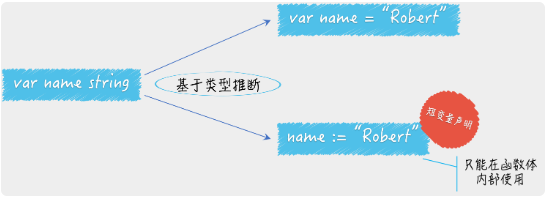
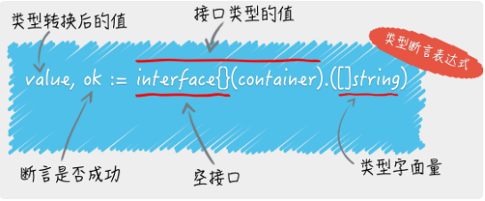
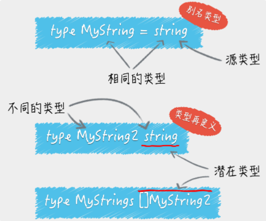

# 基础

## 短变量声明
````go
Name := "Rocket"
````

## 类型推断
1. 方式一
````go
var name = "Rocket"
````

2. 方式二
````go
name := "Rocket"
````


## 变量重声明
1. 范例
````go
var err error
n, err := io.WriteString(os.Stdout, "Hello, everyone!\n")
````

## 类型断言
1. 方式一
````go
var container = []string{"zero", "one", "two"}
value, ok := interface{}(container).([]string)
if ok{
	fmt.println(value)
} else {
	fmt.println("wrong type")
}
````

2. 方式二
````go
container := map[int]string{0: "zero", 1: "one", 2: "two"}
switch t := container.(type) {
    case string:
        fmt.println("it's string type")
    case int64:
	    fmt.println("it's int type")
    case map[int]string:
        elem = t[1]
    default:
        err = fmt.Errorf("unsupported container type: %T", container)
    return
}
````


## 别名类型
1. 范例
````go
type MyString1 = string
````

## 潜在类型
1. 范例
````go
type MyString2 string
````
