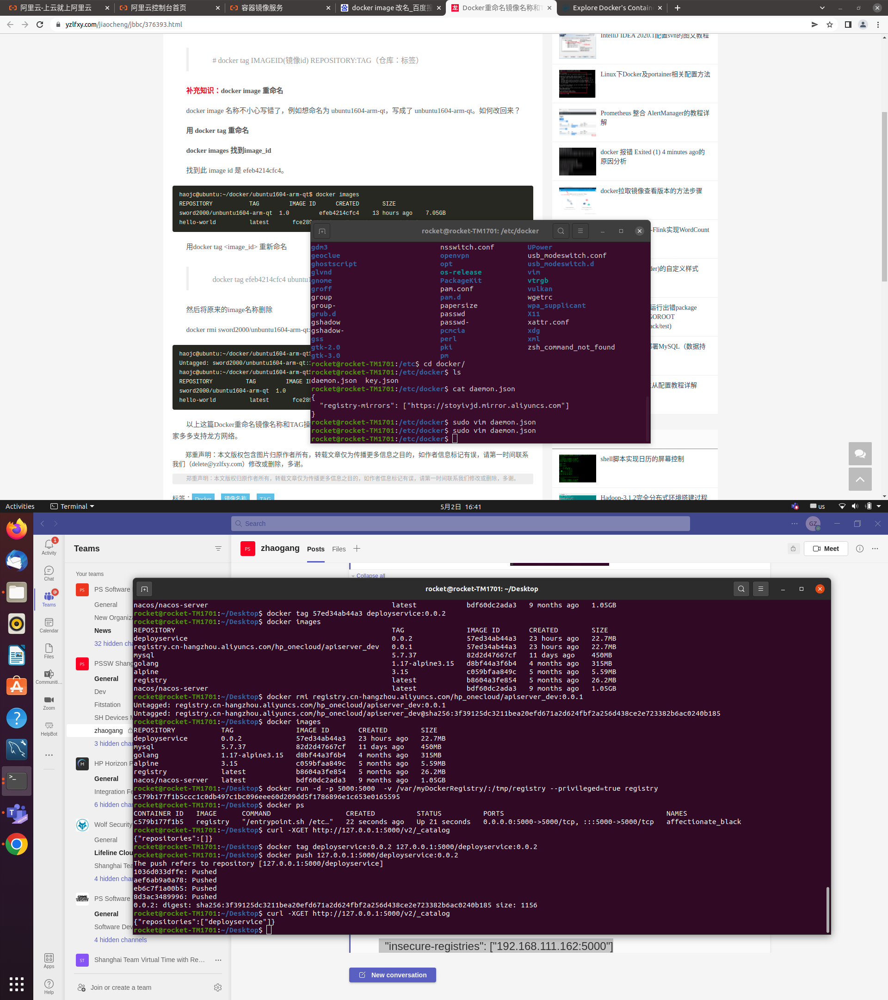

# Headings
## The second heading

------------------

# Styling text
**This is bold text**

*This text is italicized*

~~This was mistaken text~~

**This text is _extremely_ important**

***All this text is important***

<sub>This is a subscript text</sub>

<sup>This is a superscript text</sup>

--------------------

# Quoting text
> Text that is a quote

Use `git status` to list all new or modified files that haven't yet been committed.

Some basic Git commands are:
```
git status
git add
git commit
```

--------------------

# Links

This site was built using [GitHub Pages](https://pages.github.com/).

--------------------

# Section Links

??????????????

--------------------

# Relative links

[Contribution guidelines for this project](../README.md)

---------------------




-----------------------

# Lists

- George Washington
- John Adams
- Thomas Jefferson

1. James Madison
2. James Monroe
3. John Quincy Adams

-----------------------

# Nested Lists

1. First list item
    - First nested list item
        - Second nested list item

-----------------------

# Task lists

- [x] #739
- [ ] https://github.com/octo-org/octo-repo/issues/740
- [ ] Add delight to the experience when all tasks are complete :tada:

-----------------------

# Footnotes

Here is a simple footnote[^1].

A footnote can also have multiple lines[^2].

You can also use words, to fit your writing style more closely[^note].

[^1]: My reference.

[^2]: Every new line should be prefixed with 2 spaces.  
This allows you to have a footnote with multiple lines.

[^note]:
Named footnotes will still render with numbers instead of the text but allow easier identification and linking.  
This footnote also has been made with a different syntax using 4 spaces for new lines.

------------------------

# Hiding content with comments

<!-- This content will not appear in the rendered Markdown -->


