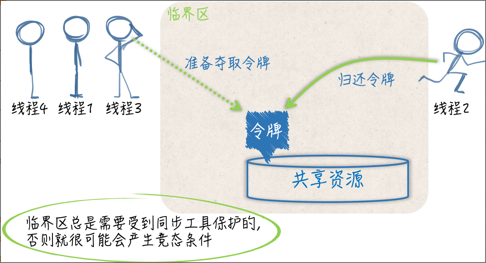
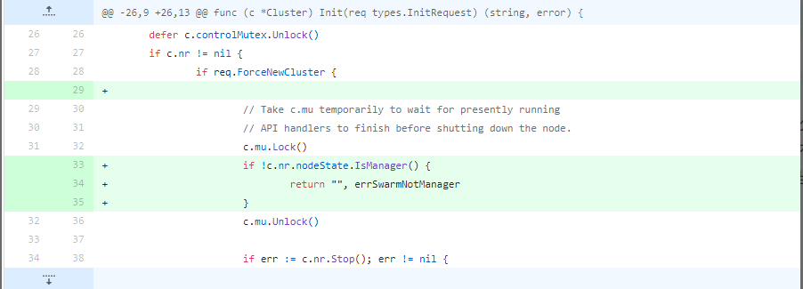
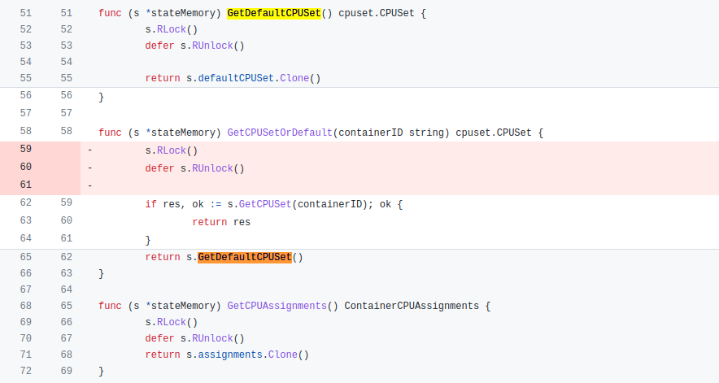

# Mutex & RWMutex

## 实现机制
1. 使用互斥锁，限定临界区只能由一个线程持有


2. 读写锁
    - 写锁锁定时，阻塞"试图获取写或读锁"的线程
    - 读锁锁定时，阻塞"试图获取写锁"的线程，但不阻塞"试图获取读锁"的线程

## 易错场景
1. Lock/Unlock未成双出现
````go
func foo() {
    var mu sync.Mutex
    defer mu.Unlock()
    fmt.Println("hello world!")
}
````

2. 复制传递mutex, 如需传递需通过指针
````go
type Counter struct {
    sync.Mutex
    Count int
}

func main() {
    var c Counter
    c.Lock()
    defer c.Unlock()
    c.Count++
    foo(c) // 复制锁
}

// 这里Counter的参数是通过复制的方式传入的
func foo(c Counter) {
    c.Lock()
    defer c.Unlock()
    fmt.Println("in foo")
}
````

3. 重入
````go
func foo(l sync.Locker) {
    fmt.Println("in foo")
    l.Lock()
    bar(l) // 重入
    l.Unlock()
}

func bar(l sync.Locker) {
    l.Lock()
    fmt.Println("in bar")
    l.Unlock()
}

func main() {
    l := &sync.Mutex{}
    foo(l)
}
````

4. 循环死锁
- 一般来说，存在一组等待进程，P={P1，P2，…，PN}，P1 等待 P2 持有的资源，P2 等待 P3 持有的资源，依此类推，最后是 PN 等待 P1 持有的资源，这就形成了一个环路等待的死结


# 功能扩展
1. 与基础数据结构组合
````go
type SliceQueue struct {
    data []interface{}
    mu   sync.Mutex
}

func NewSliceQueue(n int) (q *SliceQueue) {
    return &SliceQueue{data: make([]interface{}, 0, n)}
}

// Enqueue 把值放在队尾
func (q *SliceQueue) Enqueue(v interface{}) {
    q.mu.Lock()
    q.data = append(q.data, v)
    q.mu.Unlock()
}

// Dequeue 移去队头并返回
func (q *SliceQueue) Dequeue() interface{} {
    q.mu.Lock()
    if len(q.data) == 0 {
        q.mu.Unlock()
        return nil
	}
    v := q.data[0]
    q.data = q.data[1:]
    q.mu.Unlock()
    return v
}
````

# 错误案例
1. Docker issue [34811](https://github.com/moby/moby/pull/34881/files).



2. K8s 重入issue [62464](https://github.com/kubernetes/kubernetes/pull/62464/files).
   - GetCPUSetOrDefault 方法会请求读锁，同时，它还会调用 GetCPUSet 或 GetDefaultCPUSet 方法。
   - 当这两个方法都请求写锁时，是获取不到的，因为 GetCPUSetOrDefault 方法还没有执行完，不会释放读锁，这就形成了死锁
   

     
# 思考

